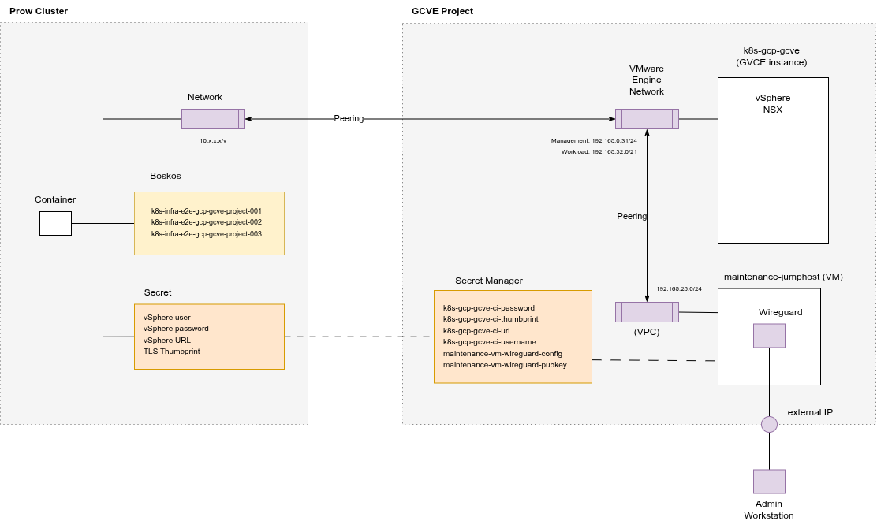

# Overview

The code in `k8s-infra-gcp-gcve` sets up the infra required to allow prow jobs to create VMs on vSphere, e.g. to allow testing  of the [Cluster API provider vSphere (CAPV)](https://github.com/kubernetes-sigs/cluster-api-provider-vsphere).



Prow container settings are managed outside of this folder, but understanding high level components could
help to understand how the `k8s-infra-gcp-gcve` is set up and consumed.

More specifically, to allow prow jobs to create VM on vSphere, a few resources are made available to a prow container, so as of today only in the `k8s-infra-prow-build` prow cluster.

- A secret, added via the `preset-gcve-e2e-config` [preset](https://github.com/kubernetes/test-infra/blob/master/config/jobs/kubernetes-sigs/cluster-api-provider-vsphere/cluster-api-provider-vsphere-presets.yaml), that provides vSphere URL and vSphere credentials
- A set of Boskos resources of type `gcve-vsphere-project`, allowing access to:
    - a vSphere folder and a vSphere resources pool where to run VMs during a test.
    - a reserved IP range to be used for the test e.g. for the kube vip load balancer in a CAPV cluster (VM instead will get IPs via DHCP).

Also, the network of the prow container is going to be peered to the VMware engine network, thus
allowing access to both the GCVE management network and the NSX-T network where all the VM are running.

The `k8s-infra-gcp-gcve` project sets up the infrastructure that actually runs the VMs created from the prow container. 
These are the main components of this infrastructure:

The terraform manifest in this folder uses the GCP terraform provider for creating.
- A VMware Engine instance
- The network infrastructure required for vSphere and for allowing communication between vSphere and Prow container.
    -  The network used is `192.168.32.0/21`
        - Usable Host IP Range:	`192.168.32.1 - 192.168.39.254`
            - DHCP Range: `192.168.32.11 - 192.168.33.255`
            - IPPool for 40 Projects having 16 IPs each: `192.168.35.0 - 192.168.37.127`
- The network infrastructure used for maintenance.

See [terraform](./docs/terraform.md) for prerequisites.

When ready:

```sh
terraform init
terraform plan # Check diff
terraform apply
```

See inline comments for more details.

The terraform manifest in the `/maintenance-jumphost` uses the GCP terraform provider to setup a jumphost VM to be used to set up vSphere or for maintenance purposes. See
- [maintenance-jumphost](./maintenance-jumphost/README.md)

The terraform manifest in the `/vsphere` folder uses the vSphere and the NSX terraform providers to setup e.g. content libraries, templates, folders, 
resource pools and other vSphere components required when running tests. See:
- [vsphere](./vsphere/README.md)

# Working around network issues

## Packages are dropped without any hop

Example: `mtr -T -P 443 1.2.3.4` shows no hop at all (not even the gateway)

It could be that NSX-T started dropping traffic to that endpoint.

The workaround is documented in [Disabling NSX-T Firewalls](./vsphere/README.md#disabling-nsx-t-firewalls)

## Setting the right MTU

Setting the right MTU is important to not run into connectivity issues due to dropped packages.
For the workload network `k8s-ci` in NSX-T, the correct MTU is configured in [nsx-t.tf](./vsphere/nsx-t.tf) and was determined by using `ping` e.g. via [this bash script](https://gist.githubusercontent.com/penguin2716/e3c2186d0da6b96845fd54a275a2cd71/raw/e4b45c33c99c6c03b200186bf2cb6b1af3d806f5/find_max_mtu.sh).

# Uploading OVA's

Pre-created OVA's are available at [Cluster API Provider vSphere releases](https://github.com/kubernetes-sigs/cluster-api-provider-vsphere/releases?q=%22VM+templates%22&expanded=true).

There is a script which automates the download from Github, concatenate files (if necessary) and upload to vSphere.

First we have to identify the link or links for an OVA.

E.g. from [templates/v1.33.0](https://github.com/kubernetes-sigs/cluster-api-provider-vsphere/releases/tag/templates%2Fv1.33.0):

* https://github.com/kubernetes-sigs/cluster-api-provider-vsphere/releases/download/templates%2Fv1.33.0/ubuntu-2204-kube-v1.33.0.ova-part-aa
* https://github.com/kubernetes-sigs/cluster-api-provider-vsphere/releases/download/templates%2Fv1.33.0/ubuntu-2204-kube-v1.33.0.ova-part-ab

Then we have to set credentials and run the script with both urls as parameters:

```sh
export GOVC_URL="$(gcloud vmware private-clouds describe k8s-gcp-gcve --location us-central1-a --format='get(vcenter.fqdn)')"
export GOVC_USERNAME="solution-user-01@gve.local"
export GOVC_PASSWORD="$(gcloud vmware private-clouds vcenter credentials describe --private-cloud=k8s-gcp-gcve --username=solution-user-01@gve.local --location=us-central1-a --format='get(password)')"

infra/gcp/terraform/k8s-infra-gcp-gcve/vsphere/scripts/upload-ova.sh https://github.com/kubernetes-sigs/cluster-api-provider-vsphere/releases/download/templates%2Fv1.33.0/ubuntu-2204-kube-v1.33.0.ova-part-aa https://github.com/kubernetes-sigs/cluster-api-provider-vsphere/releases/download/templates%2Fv1.33.0/ubuntu-2204-kube-v1.33.0.ova-part-ab
```

# Recreating the whole environment

Deleting a Google Cloud VMware Engine (GCVE) Private Cloud results in a 1 week freeze of the old environment.
Because of that it is not possible to immediately recreate the environment using the same configuration.

If recreation needs to be done, we have to change the following:

* The management cidr (`192.168.31.0/24`, search for all occurencies of `192.168.31`)
* The name of the private cloud (search for all occurencies of `k8s-gcp-gcve`)

For deleting the old environment:

* Use the UI for [Private Clouds](https://console.cloud.google.com/vmwareengine/privateclouds?project=broadcom-451918) to start the deletion process
  * Note: With starting the deletion process, the Private Cloud will also not be billed anymore.
* Afterwards setup terraform as described above and remove the private cloud from the state:
  * `terraform state rm google_vmwareengine_private_cloud.vsphere-cluster`
* Finally use the above documentation to re-provision VMware Engine
